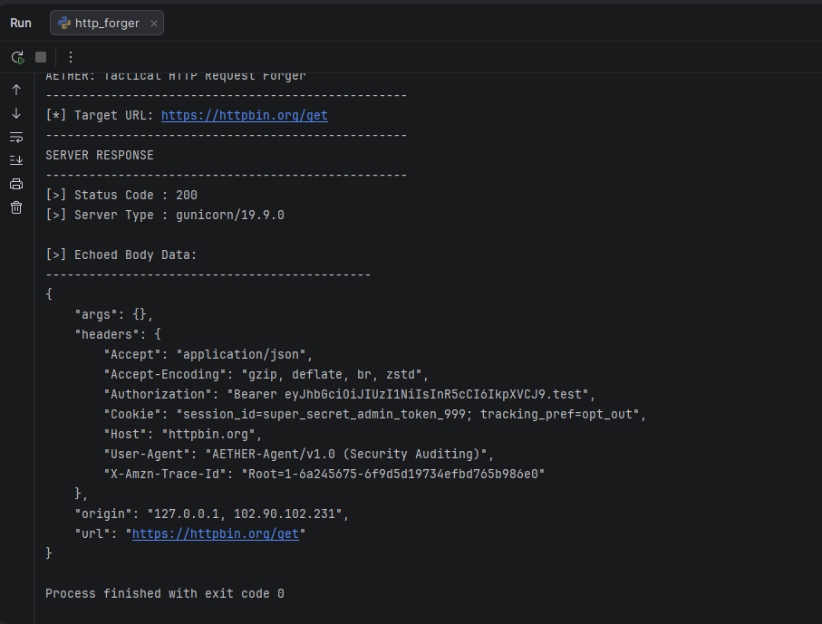

# AETHER: HTTP Request Forger

An active engagement tool built in Python using the `requests` library to construct and transmit customized HTTP probes. 

This utility is designed for application security testing, allowing an auditor to spoof headers, inject forged cookies, and bypass basic WAF restrictions by programmatically mimicking specific browser or agent behaviors.

## Features
* **Custom Header Injection:** Allows modification of critical HTTP headers (e.g., `User-Agent`, `X-Forwarded-For`, `Authorization`) to test server-side validation and spoof origins.
* **Session Forgery:** Accepts custom cookie dictionaries to test session hijacking scenarios and privilege escalation vectors.
* **Fault-Tolerant Architecture:** Implements strict connection timeouts and atomic exception handling via `requests.exceptions.RequestException` to prevent process hanging during unresponsive server events.


## Prove of Concept (PoC)
* a screenshot demonstration of the script output on my 127.0.0.1




## Installation & Usage

1. **Navigate to the tool's folder:**
   ```bash
   cd http_forger
   

2. Install dependencies
    
    This tool requires the third-party requests library.
    ```bash
    pip install requests
   
3. Execute the script:
    ```bash
    python http_forger.py

## Under the Hood

By default, the script targets httpbin.org/get, a highly utilized diagnostic endpoint that safely echoes back all received headers and cookies. This provides immediate, visual verification that the custom payload was successfully packed into the HTTP request and interpreted correctly by the receiving server before deploying the tool against a live audit target.


