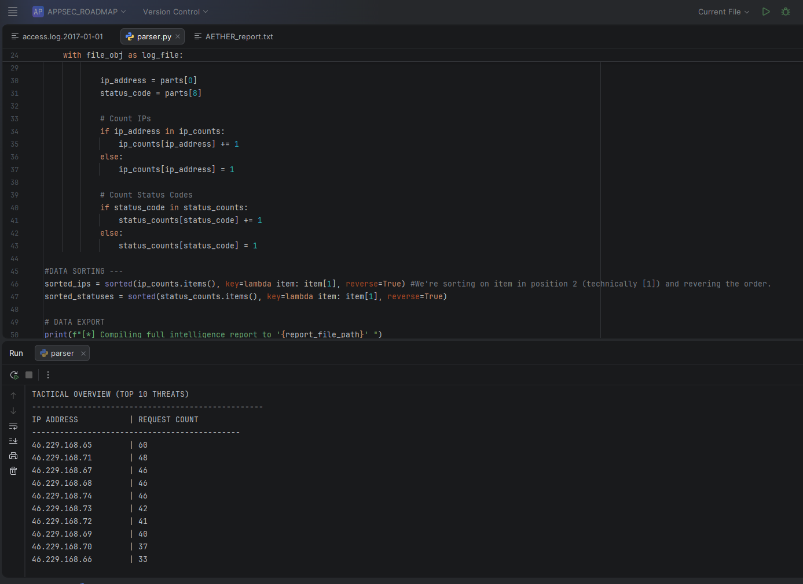

# AETHER: Tactical Log Analyzer

A lightweight, dependency-free Python parser designed for rapid threat hunting and forensic analysis of Apache and Nginx web server logs. 

Built to simulate a Security Information and Event Management (SIEM) data pipeline, this tool processes raw access logs to identify potential automated scanners, brute-force attacks, and background internet noise by calculating connection frequencies and mapping HTTP status codes.

## Features
* **Dual-Stream Output:** Prevents alert fatigue by splitting output into two streams: a sleek terminal dashboard displaying the "Top 10" immediate threats, and a comprehensive `AETHER_report.txt` file containing every recorded knock for deep-dive stealth analysis.
* **Pro Architecture:** Utilizes strict `try/except/else` file-handling blocks to gracefully manage missing or corrupted log files without swallowing core logic errors.
* **Zero Dependencies:** Engineered from scratch using Python's standard library. Counting and sorting mechanics are built manually using dictionary structures and lambda functions, bypassing the need for third-party modules.

## Proof of Concept (PoC)

The following demonstration shows the analyzer successfully parsing a dense, real-world Apache access log (`access.log.2017-01-01`). The terminal interface provides immediate tactical awareness of the highest-volume IPs (noisy scanners).



## Installation & Usage

This script operates completely standalone. Simply ensure your target web log is in the same directory as the script.

1. **Navigate to the tool's directory:**
   ```bash
   cd log_analyzer
   
2. **Ensure your target log file is correctly named:**

    By default, the script targets a file named access.log.2017-01-01. You can modify the log_file_path variable at the top of the script to target your specific .log file.


3. **Execute the parser:**
    ```bash
   python parser.py

4. **Review the Intelligence Report:**

After execution, review the terminal output for the top 10 threats, then open the newly generated AETHER_report.txt to hunt for "low and slow" single-knock attackers.

## Under the Hood (Architecture)

The engine fractures standard Apache log strings using Python's .split() method, isolating the remote IP address (Index 0) and the HTTP Status Code (Index 8). To handle potentially massive datasets (gigabytes of log data) without exhausting system memory, the tool reads the file sequentially line-by-line rather than loading the entire file into a single memory block.

Sorting is achieved via custom lambda functions targeting dictionary values, ensuring data is ranked by interaction frequency (highest to lowest) rather than alphabetically by IP.


## Acknowledgments & Data Source
The sample Apache access logs used for testing and demonstrating this tool were sourced from **SecRepo** ([secrepo.com](https://www.secrepo.com/)). SecRepo is a fantastic open-source repository of security event logs curated specifically for researchers, analysts, and students to practice threat hunting and log parsing.