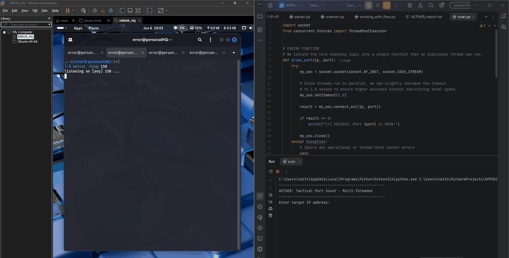

# AETHER: Tactical Port Scout

An ultra-fast, multi-threaded TCP port scanner written in Python. 

Built as a foundational reconnaissance tool for application security and network auditing, AETHER bypasses the slow, synchronous nature of standard socket connections by deploying a scalable pool of worker threads to sweep target networks in seconds.

##  Features
* **Multi-Threaded Engine:** Utilizes Python's `concurrent.futures.ThreadPoolExecutor` to handle up to 100 simultaneous connection attempts.
* **Granular Timeouts:** Optimized socket timeouts ensure rapid sweeping without sacrificing accuracy on closed or filtered ports.
* **Dependency-Free:** Built entirely using Python's standard library (`socket`, `concurrent.futures`). No third-party packages required.

## Proof of Concept (PoC)

The following demonstration shows AETHER successfully identifying active listeners on a locked-down Kali Linux environment. Netcat (`nc`) was used to temporarily open specific ports (Port 10, 80, 150, and 200) to verify the multi-threaded detection mechanics.




## Installation and Usage

Since this tool utilizes standard Python libraries, no additional `pip` installations are required.

1. **Clone the repository:**
   ```bash
   git clone [https://github.com/yourusername/aether-port-scout.git](https://github.com/yourusername/aether-port-scout.git)
   cd aether-port-scout
   
2. Run the scanner:
    ```bash
    python scan.py

3. Input your parameters:
    The interface will prompt you for the target IP address and the specific port range you wish to sweep.
    ```bash

    --------------------------------------------------
    AETHER: Tactical Port Scout - Multi-Threaded
    --------------------------------------------------
    Enter target IP address: 192.168.145.132
    Enter starting port: 1
    Enter ending port: 1024

## Under the Hood (Architecture)

The tool works by wrapping Python's low-level C-based socket API (AF_INET, SOCK_STREAM) inside a worker function. Instead of waiting for a full TCP handshake timeout sequentially, the main execution block spawns a thread pool, feeding each port in the specified range to an available worker. If a port is open, the OS returns a 0 via the .connect_ex() probe, triggering the success output.


## Disclaimer
Educational and authorized use only. This tool is designed for network administration, security research, and auditing systems you explicitly own or have permission to test. Unauthorized port scanning against external networks without consent is illegal.

